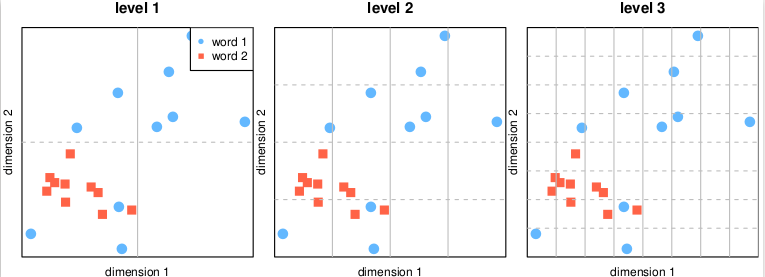

# Unsupervised Polysemy Assessment (DRAFT)

The number of senses of a given word, or polysemy, is a very subjective notion, which varies widely across annotators and resources. We propose a novel method to estimate polysemy, based on simple geometry in the contextual embedding space. Our approach is fully unsupervised and purely data-driven.

## Cite

@article{xypolopoulos2020polysemy,
  title={Unsupervised Word Polysemy Quantification with Multiresolution Grids of Contextual Embeddings},
  author={Xypolopoulos, Christos and Tixier, Antoine J-P and Vazirgiannis, Michalis},
  journal={arXiv preprint arXiv:****},
  year={2020}
}

## Acknowledgements 

We gratefully acknowledge the support of NVIDIA Corporation with the donation of the Titan V GPU used for this research.
